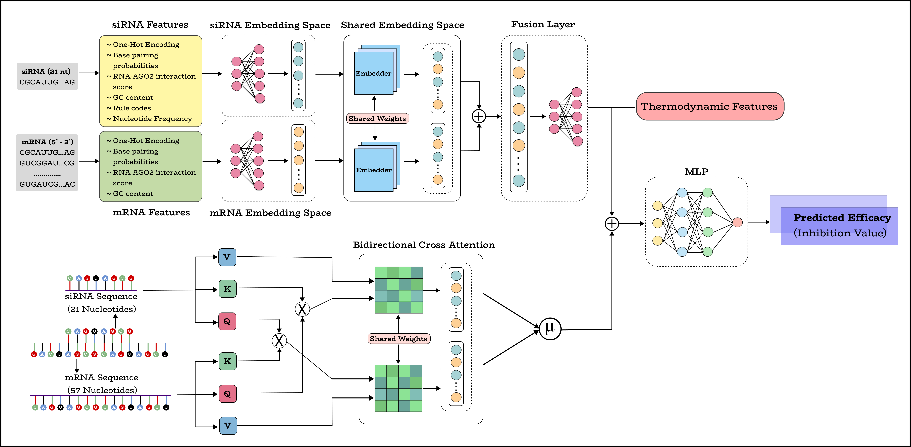

# SiaRNA: A Siamese Neural Network with Bidirectional Cross-Attention for Pairwise Modeling of siRNA-mRNA Interactions

###### A Siamese neural network with bidirectional cross-attention for predicting siRNA–mRNA efficacy.



**SiaRNA** is designed to capture thermodynamic, compositional, and contextual dependencies between siRNA and its target mRNA. Specifically, the model first processes a set of handcrafted input features using a Siamese Neural Network. In parallel, the raw nucleotide sequences of siRNA and the corresponding mRNA region are numerically encoded based on nucleotide identity and passed through a shared bi-directional cross attention mechanism.

The outputs from the feature-based and attention-based modules are then fused with thermodynamic features and passed through fully connected layers to predict the final efficacy. This hybrid design enables the model to leverage both biologically interpretable features and to learn deep representations, achieving a comprehensive understanding of siRNA-mRNA interactions.

## Dependencies

Ensure that you have the following installed to run the code smoothly:

- **Anaconda/Miniconda** (Highly recommended for environment management)
- Python 3.x
- Required packages specified in `environment.yaml`

To set up the required Python environment and install all packages, run the following commands using Conda:

```bash
conda env create -f environment.yaml
conda activate siarna
```

## Input Format
The model expects both siRNA and mRNA sequences to be provided in FASTA (.fa) format. Each siRNA entry must contain a single sequence of exactly 21 nucleotides, while the corresponding mRNA can vary between 21 and 2000 nucleotides in length. These length constraints ensure that the input strictly aligns with the biological characteristics required by the SiaRNA model for accurate prediction.


## Running the Code

You can perform inference on the model by running `infer.py`. We have included sample files, mRNA.fa and siRNA.fa, in the current directory for testing.

The script requires three arguments: a request ID, the path to the mRNA FASTA file, and the path to the siRNA FASTA file.

To run the model using the provided samples, use the following command:

```bash
python infer.py -r 123 -m data/mRNA.fa -s data/siRNA.fa
```

## References

Liu, H., Jian, Y., Zeng, C. *et al.*  
   **RNA–protein interaction prediction using network-guided deep learning.**  
   *Communications Biology*, 8, 247 (2025).  
   [https://doi.org/10.1038/s42003-025-07694-9](https://doi.org/10.1038/s42003-025-07694-9)


